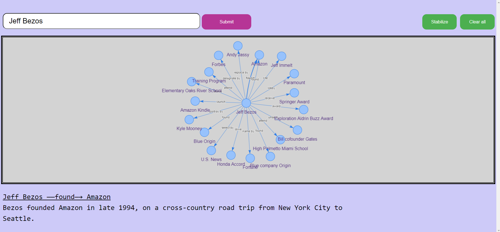

# Wiki Relations

[](https://github.com/ahmed91abbas/wiki-relations/actions)

Wiki Relations is a project that aims to extract information from a Wikipedia article and present these information in a relational graph.



## How to run the project
### Prerequisites
- Docker
- Docker Compose

To run the project simply run the following command at the root folder of the project:
```bash
docker-compose up -d --build
```

## How does it work
1. User submits a name that they wish to build the relation graph for
1. A post request is sent to the backend with that name
1. Search for the top result in Wikipedia for that name
1. Clean up the text and divide it into smaller chunks
1. For each such text chunk run the natural language processing rules and extract the relations (ex. subject --verb--> object)
1. Save the relations into the graph database (neo4j)
1. Send the response back to the frontend
1. The frontend now fetches the data from the graph database and view it on the UI

## Languages & Technologies used
|||
|----------------|----------------|
| Backend        | Python         |
| Frontend       | React          |
| Graph database | Neo4j          |
| NLP            | Spacy          |
| CI             | GitHub Actions |
|||
